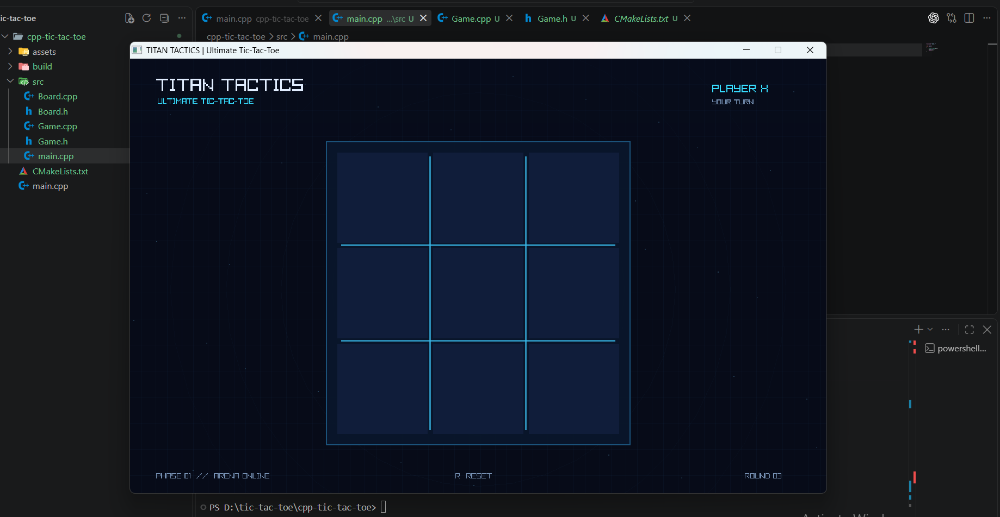
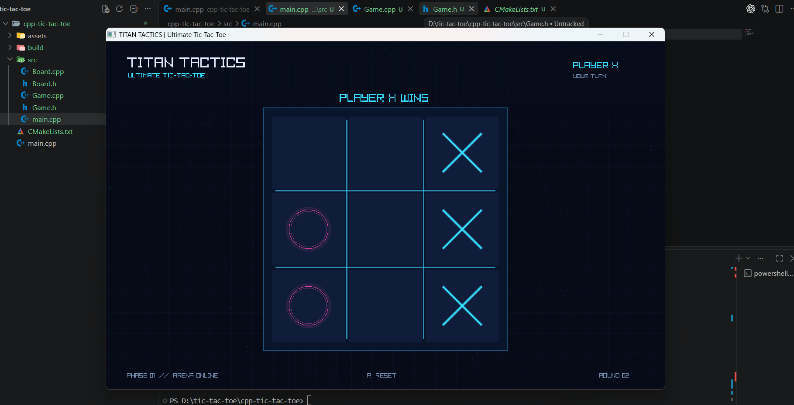

# 🎮 TITAN TACTICS

> A futuristic graphical Tic-Tac-Toe game built with modern C++ and raylib.

<p align="center">
  
</p>

## ✨ About

**TITAN TACTICS** is a graphical Tic-Tac-Toe game developed in C++ using raylib.

The project transforms the classic 3×3 game into an interactive graphical experience with a focus on clean C++ architecture, responsive controls, animations, and visual effects.

## 🎮 Gameplay

<p align="center">
  
</p>

The game supports mouse-based interaction and provides visual feedback for player moves and game results.

When a player wins, the winning combination is highlighted directly on the board.

## ✨ Features

* 🎨 Graphical 2D interface
* 🖱️ Mouse-based gameplay
* ❌ Animated X player
* ⭕ Animated O player
* 🏆 Win detection
* 🤝 Draw detection
* 🟢 Winning-line visualization
* 🔄 Instant restart
* ⚡ 60 FPS rendering
* 🧩 Modular C++ architecture

## 🧠 Technical Highlights

The project is built using a modular architecture rather than putting the entire game inside `main.cpp`.

Core concepts include:

* C++ classes
* Header/source separation
* Game loops
* Game state management
* 2D rendering
* Mouse input
* Collision/boundary detection
* Arrays and algorithms
* CMake build system

## 🛠️ Built With

* **C++17**
* **raylib**
* **CMake**
* **Ninja**
* **MSYS2 UCRT64**
* **MinGW-w64**

## 📁 Project Structure

```text
cpp-tic-tac-toe/
│
├── assets/
│       ├── image.png
│       └── game.png
│
├── src/
│   ├── main.cpp
│   ├── Game.cpp
│   └── Game.h
│
├── CMakeLists.txt
├── README.md
└── .gitignore
```

## 🚀 Build & Run

### Requirements

* MSYS2 UCRT64
* C++17 compiler
* CMake
* Ninja
* raylib

### Build

```bash
cmake -S . -B build -G Ninja
cmake --build build
```

### Run

```bash
./build/tic-tac-toe.exe
```


